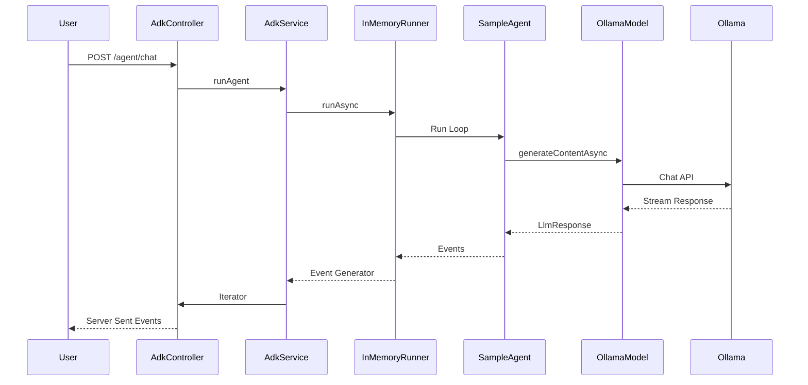

# ADK Agent Example with NestJS and Ollama

This is a sample agent application showcasing the use of the **Google Agent Development Kit (ADK)** with **NestJS** and **Ollama**.

The agent uses the **A2A Protocol** (stubbed integration) and runs entirely with open-source solutions.

## Architecture

- **NestJS**: Provides the server framework and API endpoints.
- **Google ADK**: Manages the agent lifecycle, tools, and execution flow.
- **Ollama**: Local LLM provider (using `llama3` by default).
- **A2A Protocol**: Exposed via `/a2a` endpoints for agent interoperability.

### Components
- `src/adk/models/ollama.model.ts`: Custom adapter connecting ADK to Ollama.
- `src/adk/adk.service.ts`: Manages the ADK `InMemoryRunner` to execute the agent.
- `src/agent/sample.agent.ts`: Defines the agent instructions and tools.
- `src/agent/greeting.tool.ts`: A sample tool to demonstrate function calling.

### Call Flow Sequence



## Prerequisites

1. **Node.js**: v18 or later.
2. **Ollama**: Installed and running. [Download Ollama](https://ollama.com).

## Setup Ollama Models

Before running the app, ensure you have the `llama3` model (or the one you configured) pulled locally:

```bash
ollama pull llama3
```

```bash
ollama list
ollama serve
```

## Configuration

The application supports both **Ollama** (default) and **Google Gemini** models. You can configure this via environment variables.

1. Create a `.env` file in the root directory (copy from `.env.example`):
   ```bash
   cp .env.example .env
   ```

2. Edit `.env` to set your provider:

   **For Ollama (Default):**
   ```bash
   MODEL_PROVIDER=ollama
   ```

   **For Google Gemini:**
   1. Get your API key from [Google AI Studio](https://aistudio.google.com/app/apikey).
   2. Configure `.env`:
   ```bash
   MODEL_PROVIDER=gemini
   GOOGLE_API_KEY=your-gemini-api-key
   ```

## Installation

```bash
npm install
```

## How to Run

1. Start the NestJS server:
   ```bash
   npm run start
   ```
   The server will start on `http://localhost:3000`.

2. Test the agent via `curl`:
   ```bash
   curl -N -X POST http://localhost:3000/agent/chat \
     -H "Content-Type: application/json" \
     -d '{"prompt": "Hello via NestJS!"}'
   ```

## How to use ADK UI Playground

The project includes the Google ADK, which comes with a developer UI to interact with your agents.

1. **Build the project** (if you haven't already):
   ```bash
   npm run build
   ```

2. **Start the ADK Web UI**:
   Run the following command to start the playground, pointing it to the compiled agent directory:
   ```bash
   npx @google/adk-devtools web dist/agent
   ```

3. **Open the UI**:
   The command will output a local URL (usually `http://localhost:8000` or similar). Open it in your browser.
   You should see `SampleAgent` listed. You can chat with it directly through this interface.

   *Note: Ensure your Ollama instance is running (`ollama serve`) as the agent will try to visual connect to it.*

## A2A Protocol

The application exposes a stub A2A implementation at:
- `GET /a2a/manifest`: To discover agent capabilities.
- `POST /a2a/message`: To send A2A messages.

You can verify it with:
```bash
curl http://localhost:3000/a2a/manifest
```
